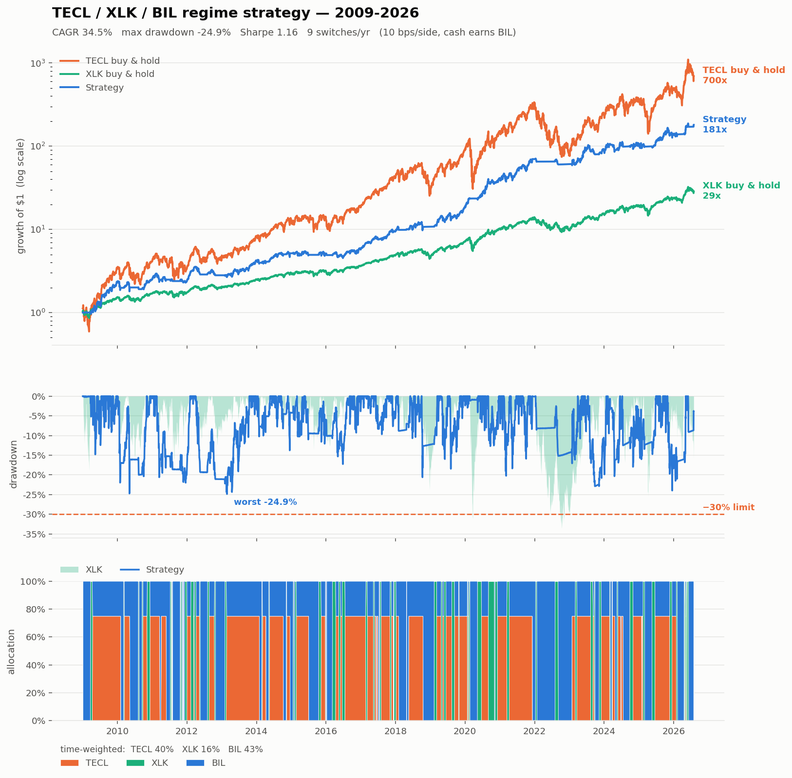

# TECL / XLK / TECS regime timing

Rotate a single tech sleeve between **XLK** (market up), **TECL** (3x long, breakout),
**TECS** (3x inverse, crash) and **BIL** (T-bills, sideways).

Target: **CAGR ≥ 30%, max drawdown ≤ 30%.**

**Result: 34.5% CAGR / −24.9% max drawdown, Sharpe 1.16** (2009-01 → 2026-07, 10 bps/side).
Both targets met with margin. **TECS is not used** — it was tested exhaustively and
subtracts value at every exposure level above noise. See *The TECS verdict* below.



---

## The strategy

Signals are computed on XLK's close at day *t* and held over day *t+1*.

| State | Condition | Hold |
|---|---|---|
| **Breakout** | above trend **and** within 4% of the 60-day high **and** 60-day return > 0 **and** 20-day vol below its 75th pctile **and** 90-day log-price slope > 0 **and** RSI(14) ≤ 75 | **75% TECL** / 25% BIL |
| **Up** | XLK above its 90-day SMA | **100% XLK** |
| **Sideways / down** | otherwise | **100% BIL** |
| **Circuit breaker** | 20-day realised vol ≥ its 85th percentile | force **BIL** |
| **Confirmation** | a new state must persist **5 consecutive days** before it is acted on | |

Time-weighted: 40% TECL, 16% XLK, 43% BIL. About 9 switches per year.

Two knobs matter most. `tecl_w` (0.75) sets where the strategy sits on the
CAGR-vs-drawdown line — 0.70 gives 32.4%/−23.5%, 0.85 gives 38.5%/−28.0%. The
5-day confirmation is what converts a whipsaw-prone signal into a tradable one.

Config lives in `final.py` (`PARAMS`, plus `PARAMS_CONSERVATIVE` at `tecl_w=0.70`).

## Results

| | CAGR | maxDD | Sharpe | Calmar |
|---|---|---|---|---|
| **Strategy** | **34.5%** | **−24.9%** | **1.16** | 1.39 |
| XLK buy & hold | 20.8% | −33.6% | 0.91 | 0.62 |
| TECL buy & hold | 44.3% | −78.0% | 0.87 | 0.57 |

Worst calendar year is 2022 at **−13.0%** (XLK −27.7%). No year worse than −13%.
Worst rolling 3-year window is +6.8% (2010-2012) — never negative.

## How it was built

Roughly **110,000 backtests** across eight stages. Each stage was aimed at what the
previous stage's diagnosis showed, not at a blind grid.

| Stage | Question | Outcome |
|---|---|---|
| 1 | best long side (XLK/TECL/BIL) | 33% CAGR but −48% DD |
| — | *diagnosis* | drawdowns were **chop, not crashes** — 2022 lost 44% while in BIL 75% of the time |
| 2 | vol gates, VIX gates, circuit breakers | 35.0% / −34.8% |
| 3 | **does TECS ever help?** | **no** — see below |
| 4 | position sizing (vol-target vs fixed) | fixed fraction wins; 32.1% / −31.0% |
| 5 | trend-quality gates (efficiency ratio, RSI, MACD) | RSI ceiling helps, ER doesn't |
| 6 | voting rule instead of AND-chains | higher CAGR, same Calmar ceiling |
| 7 | the CAGR/DD frontier | first 30/30 hit — but on a **spike** |
| 8 | **robustness-aware selection** | final pick, chosen on its *neighbourhood* |

Stage 8 is the one that matters. Stage 7's best-scoring config had `confirm_up=5`
giving −29% DD while 4 and 6 both gave ≈−35% — a fitting artifact. Stage 8 re-scored
every config by the configs one grid step away in each dimension and kept only those
whose whole region works. That pick is both more robust *and* better: Sharpe 1.16 vs
1.05, drawdown −24.9% vs −29.2%.

## The TECS verdict

The brief asked for a short sleeve. It was tested twice — once on the stage-2 core
(5,832 configs) and again on the final, stronger core (3,888 configs) — sweeping
momentum depth/window, position vs the long MA, vol percentile, drawdown from high,
VIX level, trend slope and gate persistence.

Against the final core, of **2,805 configs that actually took a short position:**

- **0** beat TECS-off on both CAGR and drawdown
- **0** beat TECS-off on Sharpe

Degradation is monotone with exposure — mean CAGR falls 27.8% → 8.8% and mean
drawdown deepens −49% → −68% as TECS exposure rises from <0.5% to >5%. Across the
grid, correlation of TECS exposure with CAGR is **−0.78**, with Sharpe **−0.77**.

The one configuration that looked additive held TECS for **29 days out of 4,400**
with a **45% win rate** — noise selected out of thousands of trials. Looser gates
that short meaningfully compound **−84%** to **−97%** while short.

The reason is structural: a 3x inverse fund needs a *sustained* decline. Tech
selloffs since 2009 have been sharp and V-shaped, so by the time a crash gate
confirms, the bounce takes back more than the drop gave. Sitting in BIL captures
the same crash-avoidance without paying for it. **Crash avoidance is the edge;
crash monetisation is not.**

## Robustness (`results/validation_report.txt`)

| Test | Result |
|---|---|
| **Walk-forward 2013-2026** (sizing re-picked yearly on prior data only) | **37.6% / −25.7%, Sharpe 1.19** |
| Costs 20 bps/side | 33.3% / −25.5% |
| Costs 40 bps/side | 30.9% / −26.9% |
| Execution lagged 1 day | 31.1% / −29.2% |
| Excluding 2009 (start 2010) | 29.9% / −24.9% |
| Perturbation: `prox_n`, `mom_n`, `vol_max`, `rsi_max`, `cb_vol_pct`, `tecl_w` | 5/5 neighbours still meet 30/30 |

### Known fragilities — read these

1. **`confirm_up=5` is still the weakest parameter.** 34.5%/−24.9% at 5, but 28.0%/−33.6%
   at 4. Degradation above 5 is graceful (cu=6 → 32.1%/−30.1%), below 5 it is not.
   This is the one value that was not fully de-risked by stage 8.
2. **The edge is XLK-specific.** Running identical rules on QQQ gives 23.5%/−40.8%.
   That is a large unexplained sensitivity to the signal ticker.
3. **Needs same-day close execution.** Each day of delay costs ≈3 points of CAGR.
4. **No pre-2009 data exists.** TECL and TECS were launched 2008-12-17, so the strategy
   has never been tested against a dot-com or GFC-scale event. The −24.9% drawdown is
   the worst of a 17-year sample that contains no such episode.
5. **2009 flatters the headline.** It contributed +130.6%; excluding it, CAGR is 29.9%.

## Data integrity

`download_data.py` pulls full histories from EODHD in one request per ticker and
overwrites — never appends, because EODHD restates `adjusted_close` on every split
and welding an old file to a new tail fabricates split-sized bars.

Two real defects were found and are repaired in `data.py`:

- **TECS `adjusted_close` is unusable.** Its ratio to `close` moves on ~900 days;
  regressed against XLK it gives beta −2.40 / corr −0.75 instead of −3.0 / −0.99.
- **TECS `close` carries correct returns but is not back-adjusted** for the fund's
  eight reverse splits (1:5, 1:5, 1:4, 1:5, then 1:10 four times), so price jumps
  4-10x on those ex-dates.

Repair: take returns from `close` and divide out the split factor on the eight
detected split days. Splits are *detected* (realised return ÷ the −3x XLK
expectation landing within 2% of a clean integer) and asserted against the known
Direxion schedule, so a data change trips the check rather than passing silently.
After repair: **TECL beta +2.98, TECS beta −2.98, |corr| 0.995**.

Because `close` excludes distributions, the repaired TECS series slightly
understates its true return — conservative, and TECS isn't used anyway.

## Files

| File | Purpose |
|---|---|
| `download_data.py` | full-history EODHD download |
| `data_check.py` | validation that found the TECS defect |
| `data.py` | loader + split repair (**start here**) |
| `engine.py` | backtest core, cost model, metrics |
| `strategy.py` / `strategy2.py` | indicators and classifiers |
| `sweep.py` | parallel sweep harness (IS/OOS split) |
| `sweep1..8_*.py` | the eight stages |
| `diagnose.py` | drawdown attribution |
| `tecs_verdict.py`, `tecs_final_check.py` | the TECS evidence |
| `final.py` | **the chosen config** |
| `validate.py`, `finalists.py` | robustness battery |
| `plot_final.py` | the chart |
| `export.py` | writes `results/equity_curve.csv` + `results/trades.csv` |

Conventions: signal at *t*, held over *t+1* (`weights.shift(1)`); 10 bps/side on
switched notional; idle cash earns **actual BIL returns**; Sharpe is on return in
**excess of BIL**, never against zero.

### Outputs

- **`results/equity_curve.csv`** — 4,421 daily rows: `state_held` (what is owned that
  day, matching the `w_*` columns) and `state_signal` (what that close says to own
  tomorrow). `state_held(t+1) == state_signal(t)` on 100% of rows — the no-lookahead
  rule made checkable. Plus gross/cost/net return, equity, drawdown, and each
  sleeve's raw return.
- **`results/trades.csv`** — 164 holding periods with signal/entry/exit dates, asset,
  weight, days held, gross/net return, cost, the underlying's return over the same
  window, and max adverse excursion. Cash stretches are included so the periods
  reconcile to 100% of the calendar. Compounded trade returns reproduce the equity
  curve to 3e-05.

```bash
python3 download_data.py && python3 data.py   # fetch + verify
python3 validate.py                           # robustness battery
python3 plot_final.py                         # chart
python3 export.py                             # equity curve + trade blotter
```
